# 夜海泛用模组管理器 NightOcean's Mods Manager

**不绑定特定游戏 · 插件驱动**

[](LICENSE) [](#许可证)[](https://www.python.org/)

[English Documentation](README_EN.md)

<div align="center">

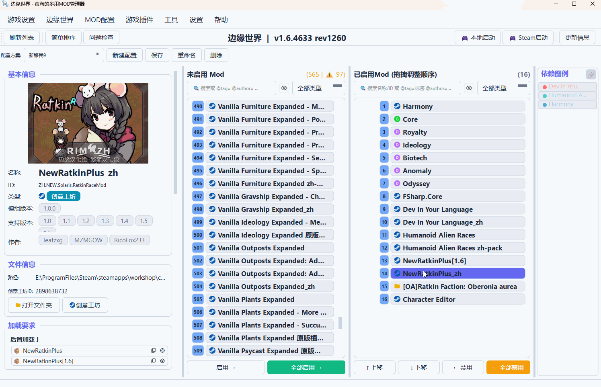

</div>

---

# 目录

- [简介](#简介)
- [核心特性](#核心特性)
- [插件系统](#插件系统)
- [快速开始](#快速开始)
- [开发者指南](#开发者指南)
- [许可证](#许可证)
- [参与贡献](#参与贡献)

---

# 简介

夜海泛用模组管理器是一款 **插件化的泛用 Mod 管理工具**，不绑定任何特定游戏，而是以**插件**为核心，通过游戏插件来支持各种游戏。

## 核心特点

| 特点 | 说明 |
|------|------|
| 一管多游 | 一个管理器管理多款游戏的 Mod |
| 社区扩展 | 社区可为任意游戏开发支持插件 |
| 功能扩展 | 功能可通过插件不断扩展 |

### 功能范围

#### ✅ 能做什么

本工具专注于 **Mod 的管理与组织**：

- **查看信息** - 查看 Mod 名称、版本、作者、依赖关系等信息（需插件正确解析元数据）
- **问题检查** - 检测缺失依赖、加载顺序错误、重复 Mod 等问题
- **排序调整** - 拖拽或智能排序来调整 Mod 加载顺序
- **配置管理** - 保存多套 Mod 配置方案，随时切换

#### ❌ 不能做什么

| 局限 | 说明 |
|------|------|
| 不加载 Mod | Mod 的实际加载由游戏完成，本工具只生成配置文件 |
| 不提供下载 | 没有 Mod 下载功能，需通过 Steam 创意工坊等途径获取 |
| 深度功能有限 | 某些游戏的深度定制功能可能比不上专用管理器 |

### 适用场景

#### 适合的 Mod 类型

本工具适合管理 **非侵入式 Mod**：

| 特征 | 说明 |
|------|------|
| 独立目录 | 每个 Mod 都有自己的目录，不直接覆盖游戏文件 |
| 元数据文件 | Mod 自带描述文件，包含名称、版本、依赖等信息 |
| 唯一标识 | 可通过 ID 或文件夹名区分不同 Mod |

**典型示例：**

| 游戏 | Mod 元数据文件 |
|------|----------------|
| 环世界 (RimWorld) | `About.xml` |
| 骑马与砍杀II：霸主 (Bannerlord) | `SubModule.xml` |
| 剑士 (Kenshi) | `*.info` 文件 |

> ⚠️ **注意**：对于直接覆盖游戏文件的"侵入式 Mod"，本工具无法很好地管理。

> 我觉得这个工具的未来可期：未来如果能完善插件生态，对于那些独立小游戏，或是本身缺乏深度 Mod 管理支持的游戏来说，完全可以通过它快速实现外部的 Mod 顺序管理功能*（当然他们得自己搞好Mod的支持和加载）*。

#### 使用建议

- **单游戏场景**：如果只管理一款游戏且该游戏已有专用管理器，专用管理器可能功能更全面
- **多游戏场景**：如果同时玩多款 Mod 游戏，或喜欢的游戏还没有专用管理器，本工具是不错的选择*（如果有人开发插件的话）*

### 开发优势

本管理器最大的优势是 **不绑定任何游戏**。开发游戏插件非常简单：

| 插件类型 | 代码量 | 功能范围 |
|----------|--------|----------|
| 基础插件 | 400-500 行 | 基本的 Mod 元数据解析和管理 |
| 进阶插件 | ~800 行 | 包含存档读取等高级功能 |

> 💡 **AI 友好开发**：本项目与 AI 合作开发，插件开发也非常适合交给 AI 完成。只需告诉 AI 游戏的 Mod 结构，AI 就能生成可用的游戏插件。

---

# 核心特性

## 多游戏支持

通过游戏插件支持多种游戏，示例如下：

> **⚠️  注意：主程序本身不包含任何插件，插件只能交给社区来开发了，毕竟浩如烟海的游戏每一个的元数据解析方法都可能不同，只有群策群力才能应对。**

| 示例游戏 | Steam App ID | 备注 |
|------|--------------|------|
| 骑马与砍杀II：霸主 | 261550 | 多人和单人分离 |
| 环世界 (RimWorld) | 294100 | 包含存档mod顺序导入 |
| 剑士 (Kenshi) | 233860 | 仅支持基础功能 |

> 💡 示例游戏插件可前往 [示例插件仓库](https://github.com/IdealNightOcean/YHModsManagerPlugins) 获取。

**想支持新游戏？** 写个游戏插件就行，不用改主程序。

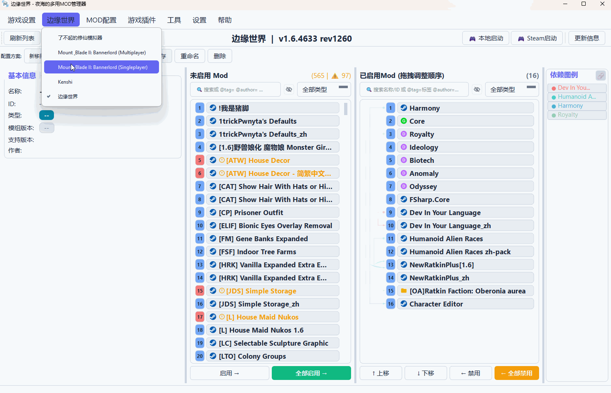

## 界面设计

| 特性 | 说明 |
|------|------|
| 双列表布局 | 左边未启用，右边已启用，一目了然 |
| 拖拽排序 | 拖一拖就能调整加载顺序 |
| 依赖关系可视化 | 通过详细信息、高亮、依赖线条多种方式展示 Mod 之间的依赖关系 |
| 信息面板 | 查看 Mod 详细信息、标签、备注等 |

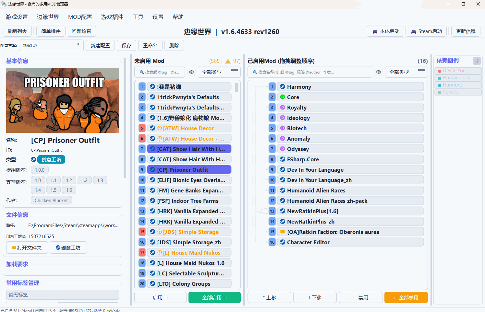

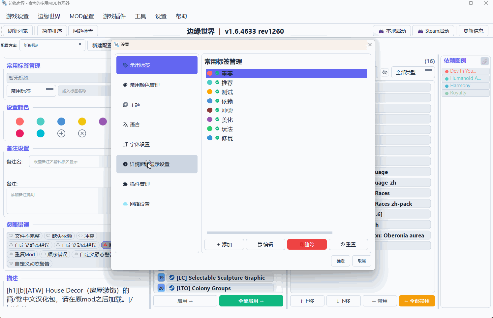

## 管理功能

### 依赖关系管理

| 功能 | 说明 |
|------|------|
| 依赖关系可视化 | 通过详细信息、高亮、依赖线条多种方式展示 Mod 之间的依赖关系 |
| 简单排序 | 可按 Mod 声明的依赖关系自动调整顺序（仅供参考） |
| 问题检查 | 一键检测缺失依赖、顺序错误等问题 |

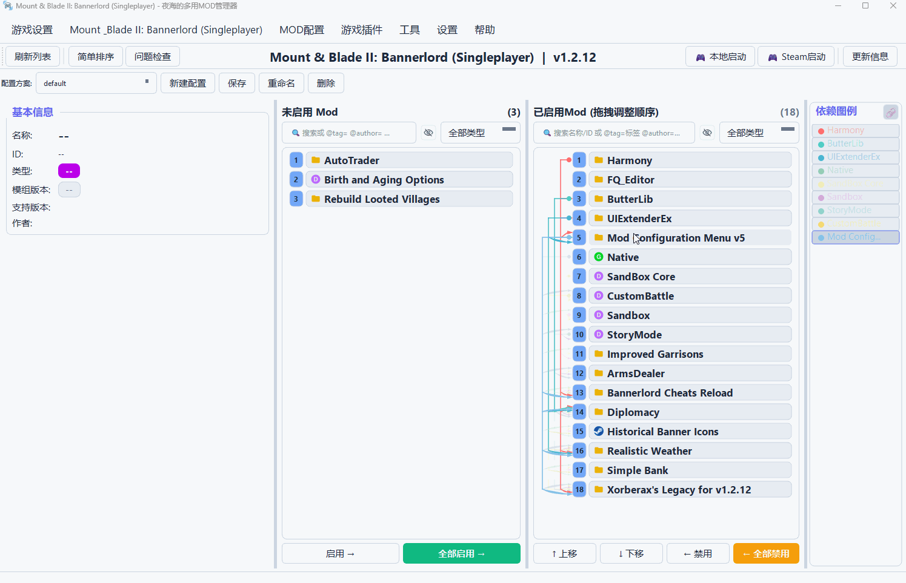

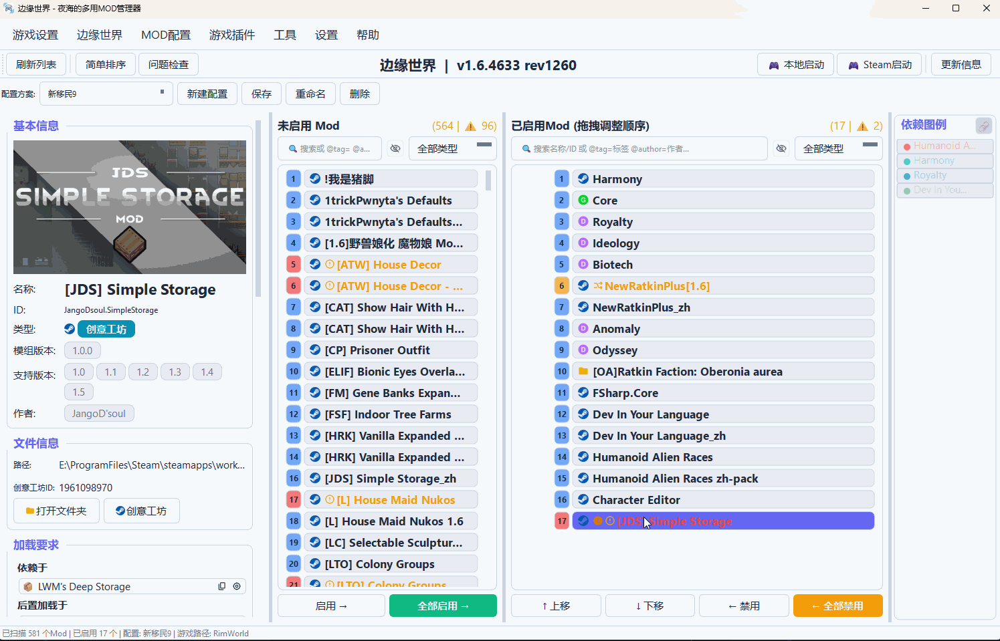

### 配置方案管理

| 功能 | 说明 |
|------|------|
| 多配置支持 | 保存不同的 Mod 组合，方便切换不同玩法 |
| 导入/导出 | 分享和备份配置很方便 |
| 从存档导入（需插件支持） | 部分游戏支持从存档恢复 Mod 配置 |

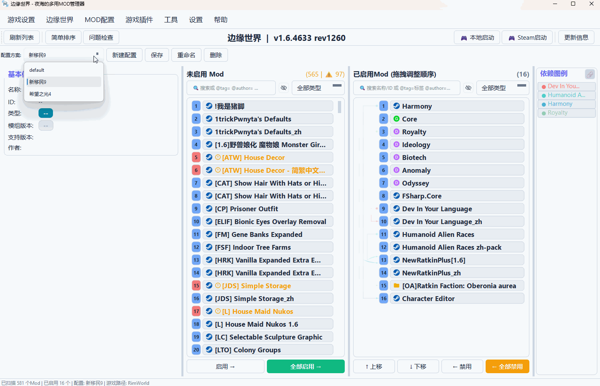

### 个性化标记

| 功能 | 说明 |
|------|------|
| 标签系统 | 给 Mod 加标签，筛选更方便 |
| 颜色标记 | 给 Mod 标颜色，一眼就能认出来 |
| 备注功能 | 给 Mod 加备注，有时候还是昵称好记 |

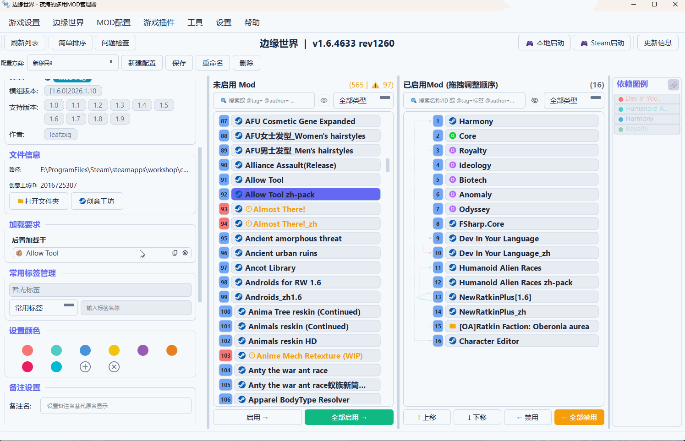

## 搜索筛选

| 功能 | 说明 |
|------|------|
| 关键词搜索 | 快速找到想要的 Mod |
| 结构化搜索 | 用 `@tag=标签名`、`@author=作者` 这样的语法 |
| 类型筛选 | 按本体、DLC、创意工坊、本地 Mod 筛选 |

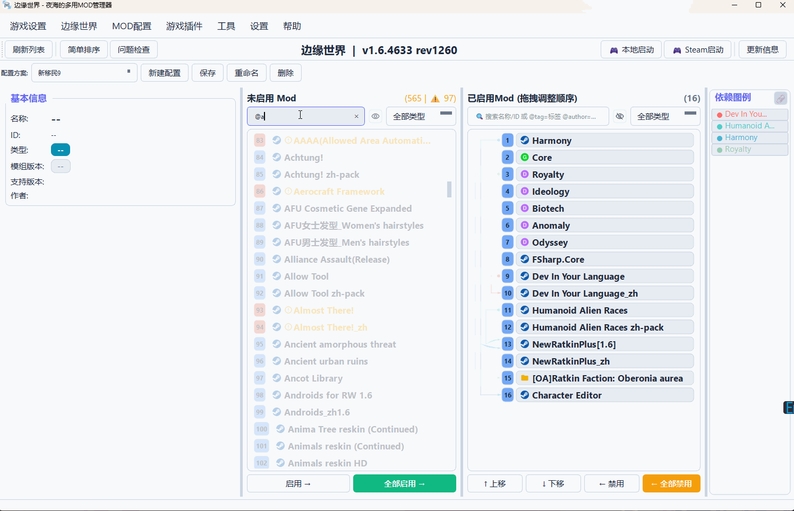

## 主题与语言

| 功能 | 说明 |
|------|------|
| 多主题 | 默认主题、深色主题等 |
| 多语言 | 中文、英文等 |
| 字体调整 | 可以调整界面字体大小 |

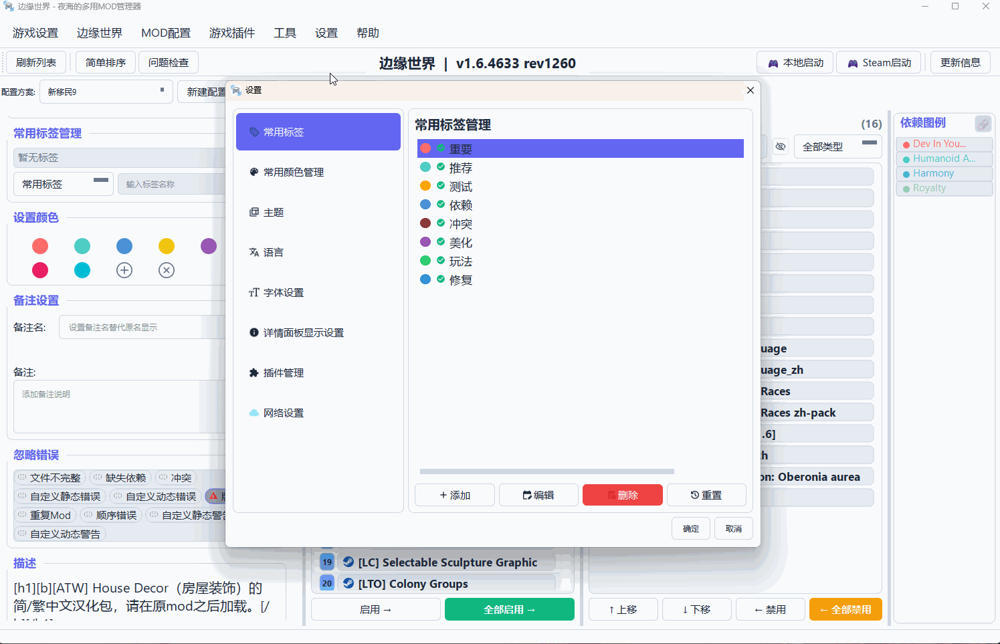

---

# 插件系统

插件系统是本工具的核心特色。

## 架构设计

传统的 Mod 管理器通常只支持一款游戏，功能也是固定的。而夜海泛用模组管理器使用插件驱动：

```
┌─────────────────────────────────────────────────────────┐
│                 NightOcean's Mods Manager               │
│                       (主程序核心)                       │
├─────────────────────────────────────────────────────────┤
│  ┌─────────────┐  ┌─────────────┐  ┌─────────────────┐  │
│  │ 游戏插件 A  │  │ 游戏插件 B  │  │   游戏插件 C    │  │
│  └─────────────┘  └─────────────┘  └─────────────────┘  │
│  ┌─────────────┐  ┌─────────────┐  ┌─────────────────┐  │
│  │ 功能插件 X  │  │ 功能插件 Y  │  │   功能插件 Z    │  │
│  └─────────────┘  └─────────────┘  └─────────────────┘  │
└─────────────────────────────────────────────────────────┘
```

## 双插件体系

| 插件类型 | 说明 | 互斥性 |
|----------|------|--------|
| **游戏插件** | 为特定游戏提供 Mod 解析和启动功能 | 同一时间只能启用一个 |
| **功能插件** | 扩展程序功能 | 可以同时启用多个 |

## 插件能力

### 游戏插件必须实现

- 解析游戏元数据和 Mod 元数据
- 提供游戏启动功能（本地启动、Steam 启动）

### 所有插件都可以实现

| 能力 | 说明 |
|------|------|
| 添加菜单项 | 在菜单栏加自己的操作 |
| 添加工具栏按钮 | 快速访问插件功能 |
| 添加自定义面板 | 展示插件特有的界面 |
| 订阅事件 | 响应 Mod 列表变化、游戏切换等事件 |
| 自定义高亮规则 | 按条件高亮显示 Mod |
| 自定义过滤规则 | 实现复杂的筛选逻辑 |
| 独立配置存储 | 保存插件自己的设置 |
| 扩展错误检测 | 添加游戏特定的 Mod 问题检测 |
| 扩展右键菜单 | 在 Mod 列表右键菜单添加操作 |

### 游戏插件还可以实现

- 解析存档文件（从存档导入 Mod 配置）
- 解析外部配置文件
- 自定义拓扑排序逻辑
- 定义游戏特定的路径验证规则

## SDK 化开发

插件开发完全 SDK 化，开发者不需要拿到主程序源码。SDK 会随 Release 一并发布：

```bash
pip install yh_mods_manager_sdk-x.x.x-py3-none-any.whl
```

**简单功能插件示例：**

```python
from yh_mods_manager_sdk import FeaturePlugin, PluginMenuItem

class MyPlugin(FeaturePlugin):
    PLUGIN_ID = "my_plugin"
    PLUGIN_NAME = "My Plugin"
    PLUGIN_VERSION = "1.0.0"
    
    def get_menu_items(self):
        return [
            PluginMenuItem(id="action", label="My Action", action_id="do_it")
        ]
    
    def on_menu_action(self, action_id, manager_collection):
        if action_id == "do_it":
            print("Action triggered!")
```

> 📖 **详细开发指南**：[插件开发文档](docs/插件开发指南.md)
> 📦 **示例插件仓库**：[YHModsManagerPlugins](https://github.com/IdealNightOcean/YHModsManagerPlugins) - 可前往查看借鉴

---

# 快速开始

程序已打包为一键运行的独立可执行文件，无需配置 Python 环境。

## 运行程序

1. 下载对应平台的可执行文件
2. 双击运行即可

## 首次使用

1. **安装游戏插件** - 程序启动后会提示安装游戏插件，选择你要管理的游戏对应的插件
2. **设置路径** - 指定游戏安装目录和 Mod 目录（程序会尝试自动检测）
3. **扫描 Mod** - 程序自动扫描可用 Mod
4. **开始管理** - 启用、排序、管理你的 Mod

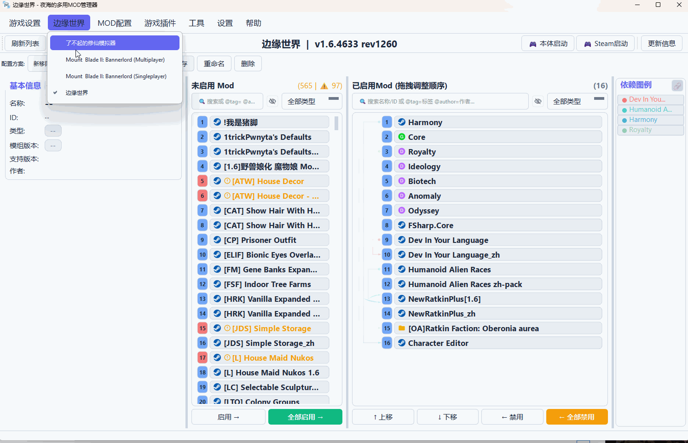

---

# 开发者指南

## 项目结构

```
YHModsManager/
├── core/                    # 核心业务逻辑
├── ui/                      # 用户界面
├── plugin_system/           # 插件系统
├── utils/                   # 工具函数
├── config/                  # 配置文件
├── docs/                    # 文档
└── yh_mods_manager_sdk/     # 插件 SDK
```

## 核心架构

项目采用分层架构：

| 层级 | 职责 |
|------|------|
| UI 层 | 界面展示与用户交互 |
| 业务逻辑层 | Mod 操作、依赖解析 |
| 数据管理层 | 配置、元数据管理 |
| 插件系统层 | 插件加载与调度 |
| 基础设施层 | 日志、事件总线等 |

## 相关文档

- [插件开发指南](docs/PLUGIN_DEVELOPMENT.md) - 插件开发教程

---

# 许可证

[](LICENSE) [](#许可证)

本项目的使用权限严格分为以下两种模式，使用者需根据场景遵守对应规则：
1.  **非商业用途**：遵循 **GNU Affero General Public License v3.0 (AGPL-3.0)** 协议，享有完整的自由使用/修改/分发权利；
2.  **商业用途**：**严禁任何形式的使用、修改、分发及衍生**。

## 非商业用途许可条款（AGPL-3.0 适用）
### 协议文本与效力
- AGPL-3.0 完整协议文本：[LICENSE-AGPL](LICENSE)
- 官方中文概要（非替代原文）：<https://www.gnu.org/licenses/agpl-3.0.zh-cn.html>
- 免责声明：<https://www.gnu.org/licenses/agpl-3.0.html#disclaimer>

### 合法使用场景（**仅限非商业用途**）
个人学习研究、非盈利组织内部运维、开源社区技术交流、免费分享修改后的非商业版本，且使用过程中**不产生任何直接/间接经济收益**。

### 你可以自由行使的权利
- **使用**：免费运行本软件及衍生版本，无功能限制；
- **共享**：复制、分发本软件完整副本（含源代码），分发时需附带本许可声明；
- **演绎**：修改、转换或以本软件为基础创作衍生作品，衍生作品必须以 AGPL-3.0 协议开源，且保留原始版权与修改记录。

### 必须遵守的强制义务
- **源代码公开**：
  1.  分发原版/修改版软件时，必须提供完整对应源代码；
  2.  将修改后的软件用于网络服务（如免费在线 Mod 管理工具）时，需向所有用户提供修改版完整源代码的下载链接；
- **署名保留**：不得删除或篡改软件内的版权声明、许可协议文本；分发或提供服务时，需以合理方式标注原始版权归属；
- **相同方式共享**：衍生作品必须采用 AGPL-3.0 协议分发，不得附加任何限制性条款；
- **无技术限制**：不得通过加密、功能锁定等技术手段，限制他人行使本协议赋予的合法权利。

## 商业用途条款
### 明确禁止的商业场景（**包含但不限于**）
- 将本软件或其衍生作品 **嵌入付费软件/服务** 中分发（如游戏付费插件、付费工具箱）；
- 企业/团队将本软件用于 **生产经营、商业管理** 等盈利相关活动；
- 向第三方提供 **基于本软件的付费 Mod 管理服务**（如收费代配置、收费技术支持）；
- 以本软件为基础开发商业产品并销售，或通过广告、流量分成等方式获取经济收益；
- 利用本软件的功能或代码，为商业主体节省成本、提升效率的任何使用行为。

### 禁止声明
**本项目不提供任何商业授权渠道，任何未经允许的商业使用行为，均视为侵犯本项目的知识产权，项目组保留追究其法律责任的权利。**

## 通用声明
1.  本软件按 **原样提供**，不提供任何形式的担保（包括适销性、特定用途适用性），项目组不对软件使用效果、稳定性及可能产生的损失承担责任；
2.  若本项目包含第三方开源代码，该部分代码将单独标注其许可协议，遵循对应条款；
3.  非商业用途的衍生作品，**同样禁止任何商业转化行为**；
4.  本许可协议的最终解释权归本项目组所有。

---

# 参与贡献

欢迎参与开发、提问题或给建议！作者对开源项目管理经验有限，如有不足之处还请多多包涵。

- **问题和建议**：通过 [Issues](https://github.com/IdealNightOcean/YHModsManager/issues) 提交问题和功能建议
- **提交代码**：欢迎提交 Pull Request

## 贡献者须知
所有向本项目提交 Pull Request 的代码贡献者，**提交行为即视为同意以下条款**：
1.  贡献者拥有所提交代码的完整版权，且未侵犯任何第三方知识产权；
2.  授予项目组 **永久、全球、非独占、免费、不可撤销的使用权**；
3.  允许项目组将贡献代码纳入本许可体系，仅用于非商业场景的分发与修改，且禁止任何商业用途；
4.  项目组有权对贡献代码进行修改、整合、分发，无需另行通知；
5.  若不同意以上条款，请勿提交代码。

---

# 致谢

**感谢所有贡献者和支持者！**